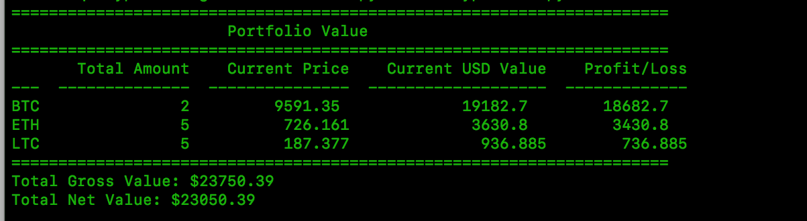

# cryptfolio

This is a script that will calculate your crypto portfolio's current amount and net value based upon two things:

How many of each coin do you have, and how much (in $USD) did you pay for those coins.

It then goes out to coinmarketcap.com's API, grabs the current price for what you have in your portfolio settings file, then multiplies that by the number of the coin you have, and subtracts the amount you paid for those coins to give you a current total of what your portfolio of coins is worth and your profit/loss.

As an example, using the included demo portfolio_details.yml settings file, you would see output like this:

## To run:

1-Clone repo
2-Install all dependencies (PyYAML, Requests, JSON and Tabulate)
3-Update the portfolio_details.yml file with number of coins you have and how much you paid for them (in USD)
4-Run script:  "python ./cryptfolio.py"
